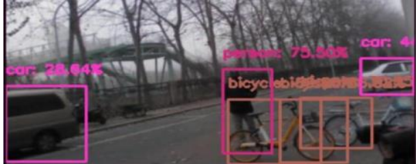

# Object Detection Using Open-Cv

Real time object detection has been attracting much interest 
due to the wide spectrum of applications. The applications of 
real time object detection include tracking objects, video 
surveillance, pedestrian detection, people counting, self-driving 
cars, face detection, ball tracking in sports and many more. If
there is a single object to be detected in an image, it is known 
as Image Localization and if there are multiple objects in an 
image, then it is Object Detection. This detects the semantic
objects of a class in digital images and videos. MobileNetv3 is a 
representative tool of Deep learning to detect objects using 
OpenCV(Opensource Computer Vision), which is a library of 
programming functions mainly aimed at real time computer 
vision.

## Software Specifications

- Python 3.7 
- TensorFlow 
- Anaconda Software 
- Machine Learning Libraries
- Jupyter Notebook
- Opencv

## On detecting of objects present in images and videos and Real-time

